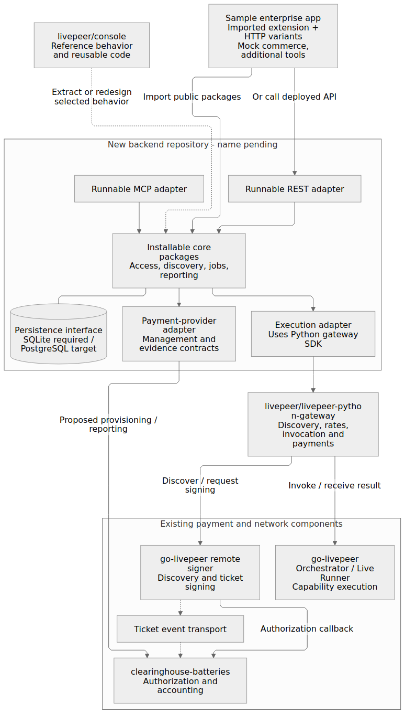
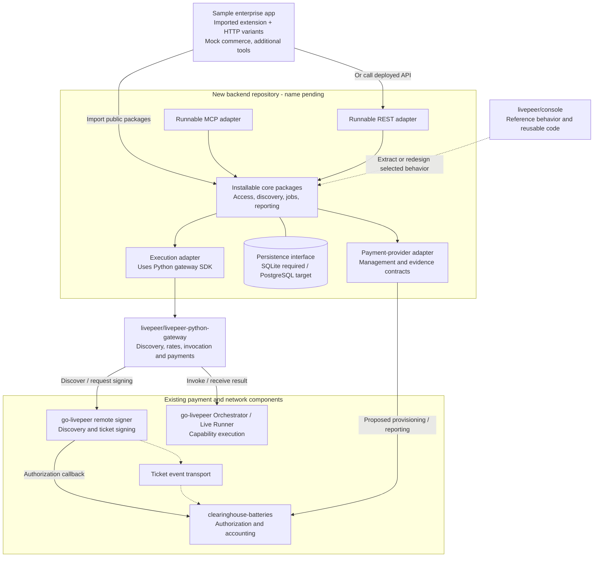
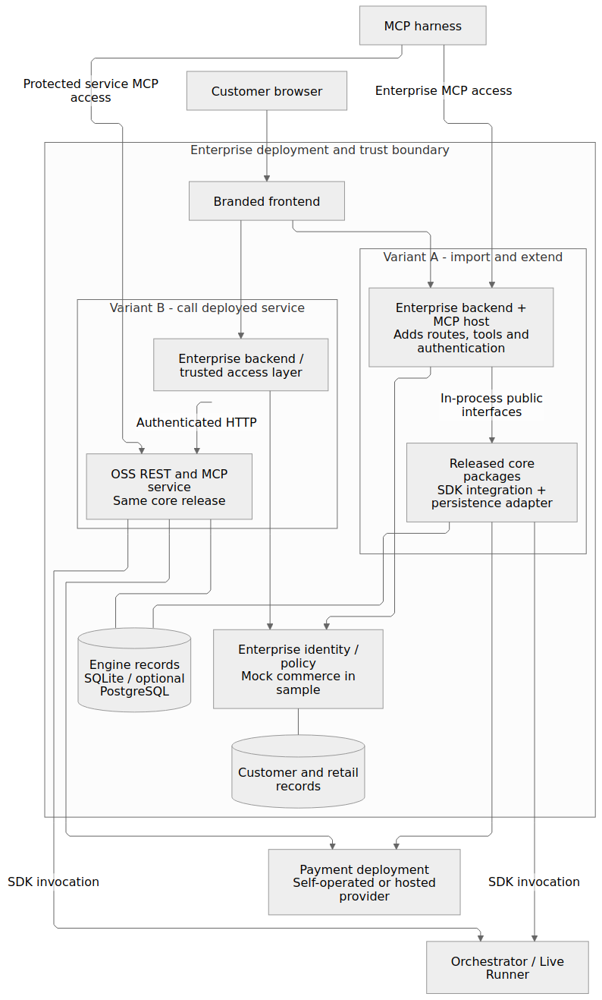
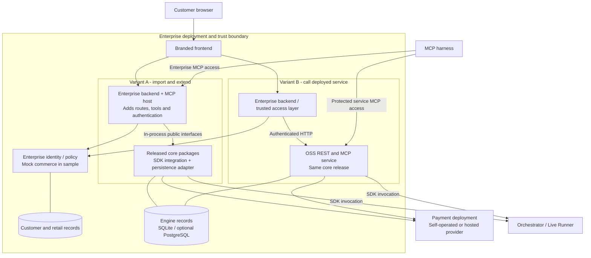
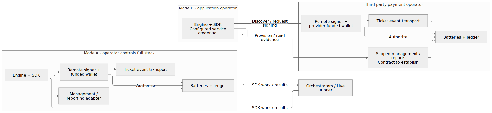
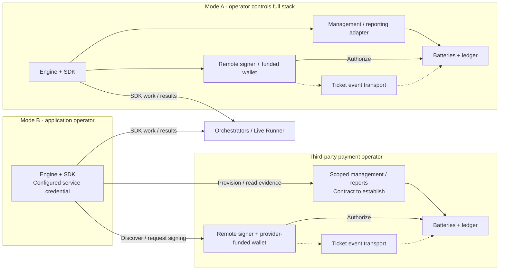
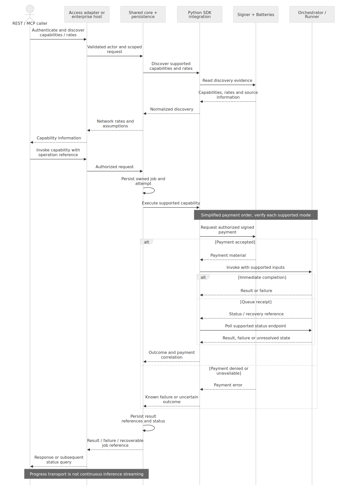
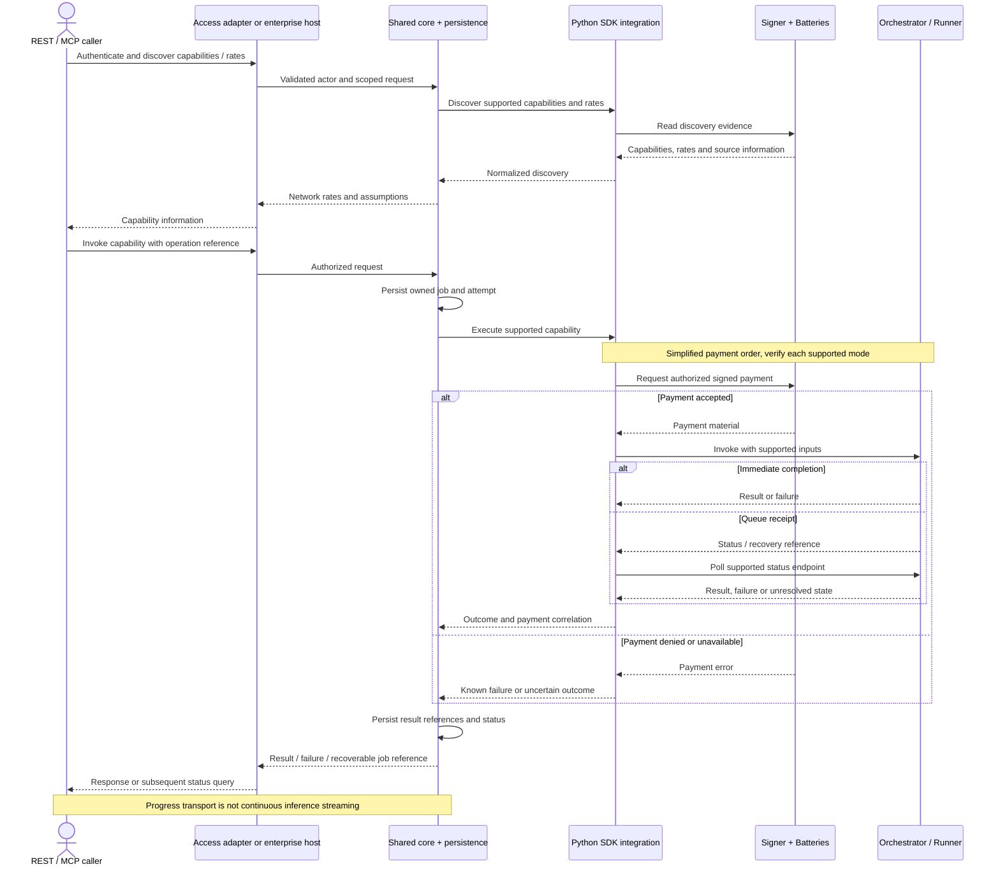
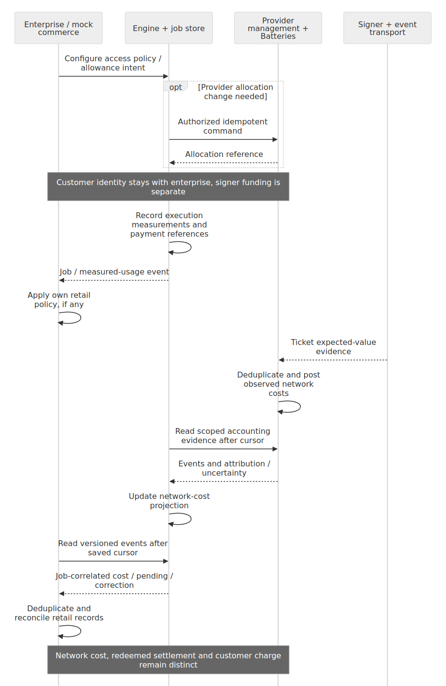
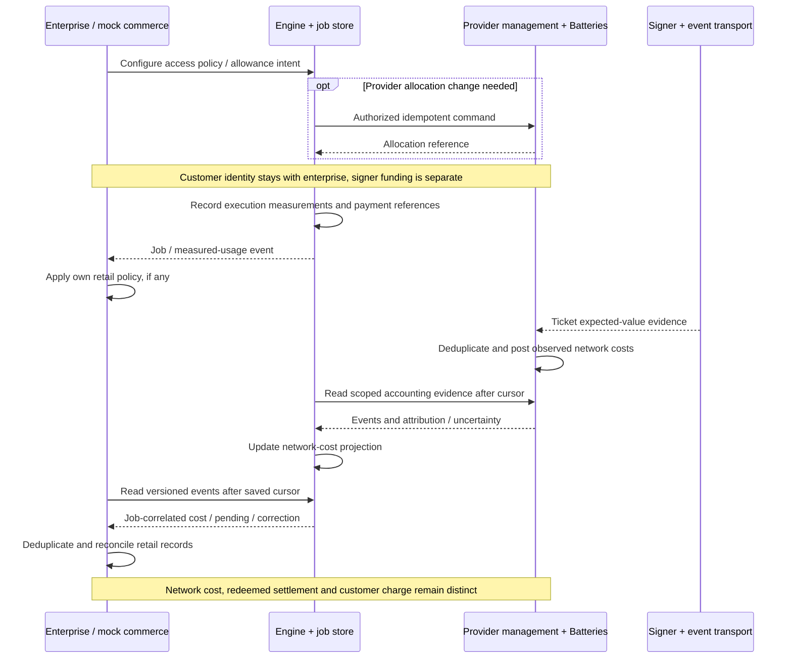

# Open Builder Engine: Architecture and Sequences

**Status:** Diagram companion to the consolidated working proposal, not approved or implemented architecture\
**Updated:** 25 September 2026\
**Owner:** Mike Zupper

The [primary architecture](self-sovereign-open-builder-stack-draft.md) owns scope,
contracts, evidence limits and open decisions. The new backend has its own
repository. In the component diagram, `livepeer/console` is an existing prototype
used as reference material; its dotted arrow represents possible code or behavior
reuse, not a runtime connection or deployment dependency. See the
[reference-only role](self-sovereign-open-builder-stack-draft.md#repositories-and-application-roles).
Every new engine interface below is proposed. Arrows express responsibilities,
not a verified protocol ordering or accepted upstream API.

## Components and repository responsibilities

Core discovery delegates through the SDK integration; the diagram does not
require independent duplicate discovery logic. REST, MCP and execution may
share a process or use separate entry points. The provider management/reporting
surface is a gap to agree, not an assertion that Batteries has those HTTP APIs.

## Enterprise deployment: two supported integration modes

The variants are alternatives, not a requirement to run duplicate backends.
The shared storage symbol indicates the same record contract, not a requirement
that separate installations share a physical database. Enterprise/customer
records remain distinct from engine records even when hosted in one database.
Exposing MCP requires the selected authentication boundary; the diagram does
not imply anonymous public access. An enterprise can also add a remote MCP
facade that uses core REST APIs. The core does not require that extra process.

## Payment operation choices

The payment operator owns funds, wallet operations, ledger and event ingestion
in each mode. Provisioning allowance is distinct from funding the wallet.
Interfaces require compatibility evidence in both deployments. Provider
migration is not automatically lossless or seamless.

## Execution sequence: REST and MCP share core behavior

The access adapter is part of the standalone service or enterprise host. In the
HTTP integration variant the enterprise calls that service; imported mode calls
the core in-process. Durable background execution and response timing require
implementation design; this sequence does not promise exactly-once execution,
automatic retries or cancellation. Persistent application endpoints belong to
the baseline, but do not themselves establish streaming support.

## Usage, network costs and example commerce

These are proposed reporting contracts, not existing guaranteed endpoints.
Mock commerce is an example/test fixture. Real customer billing may use a fixed
subscription, application usage or markup and need not await network-cost
reporting. Delayed/missing evidence is not zero; upstream event loss cannot be
repaired solely by replaying the engine projection.

## Persistence and accounting authority

SQLite plus an explicit persistence interface is the required minimum.
PostgreSQL is a delivery target, not a condition that replaces that minimum.
Both should implement the same contract for engine-owned access mappings,
jobs/attempts, result references, measured usage and cost projections, including
migrations and backup/restore. Retention must be configurable.

Enterprises can correlate stable engine identifiers with their own stores and
consume versioned events into billing/analytics. Supporting arbitrary enterprise
database schemas is not required. A PostgreSQL adapter alone does not prove
multi-instance scheduling, concurrency safety or high availability.

| Record | Authority | Meaning |
| --- | --- | --- |
| Job inputs/outputs, status and measured work | Engine/SDK execution path | What was attempted and observed; quantities only where supported |
| Allocations and ticket expected-value accounting | Batteries/payment provider | Network payment permission and observed ticket cost |
| Winning-ticket redemption | Payment operator settlement evidence | On-chain settlement; not an exact per-job cash receipt |
| Customer bill and commercial balance | Enterprise | Retail price/policy independent of network ticket settlement |

Engine reporting is a projection, not a second authoritative network ledger.
Correlate jobs, attempts, payment sessions/manifests and events explicitly; do not
assume these identifiers are interchangeable. Missing or delayed evidence is
pending/unknown, never automatically zero. Network expected-value accounting,
settlement and retail charges must remain visibly distinct.

Proposed provider management/read APIs need scoped authorization, exact units,
idempotency and stable references. Proposed reporting events need stable IDs,
versioned schemas, replay cursors and consumer deduplication. End-to-end event
completeness remains unproven. A replayable backend feed cannot recover evidence
that an upstream producer never delivered.

Allocations do not fund signer escrow. Existing evidence does not establish
strict spend reservations or hard ceilings. Revoking future access does not
reverse issued tickets, remove late fees or guarantee job cancellation. Hosted
provider switching may require credential replacement, allowance reconciliation
and handling outstanding jobs; an adapter does not make migration automatic.

## Evidence and open scope

Console `009a703d7b6434bab905902375f562e5980728af` is the pinned execution
reference. The [matrix](console-capability-and-gap-matrix.md) distinguishes
source paths from runtime verification. Additional text/media streaming is
undecided; API-key/OAuth policy and several provider
contracts are still recommendations. Diagram rendering validates syntax and
legibility, not implementation, interoperability or external commitments.
