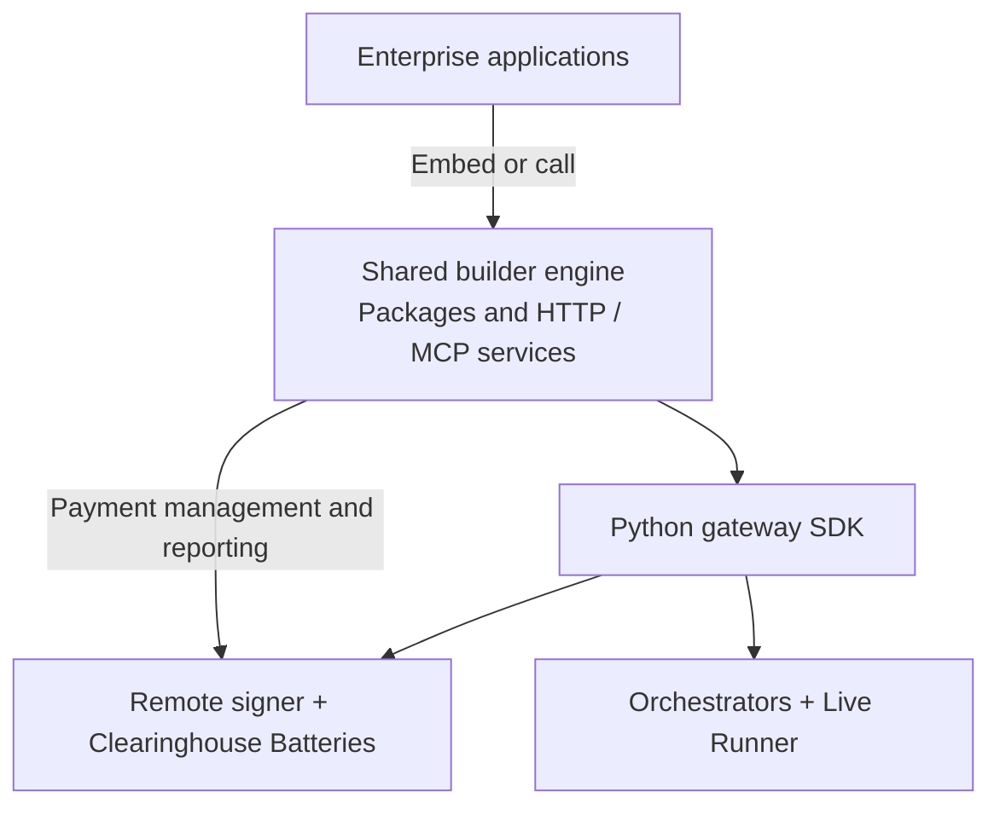

# Self-Sovereign Open Builder Stack

**Status:** Consolidated working proposal, not SPE-approved architecture or implementation\
**Updated:** 25 September 2026\
**Proposal and interim new-repository owner:** Mike Zupper

## Executive summary

Every application built on Livepeer needs to find available capabilities, check
prices, submit jobs, receive results, and understand what it used and what it
cost. The proposed Build Track deliverable brings these functions into a shared
open-source **builder engine**, so teams can reuse them as they develop their
own products.

Mike Zupper proposes to lead delivery of the engine, its documentation, and a
reference application. Livepeer Inc and other builders could embed the engine
in their applications or run it as a service. Each team would retain control of
its customer experience, workflows, and commercial model.

### Architecture at a glance

The architecture connects three layers:

1. **Enterprise applications** provide the product experience, customer accounts,
   specialized tools, and retail billing.
2. **The shared builder engine** provides access controls, discovery, job
   management, results, and usage and network-cost reporting. It exposes the same
   core functions through an HTTP API for applications and an MCP interface for
   agent tools.
3. **Existing network and payment components** provide network access, payment
   authorization and signing, accounting, and execution. The engine integrates
   the Python gateway SDK, remote signer, Clearinghouse Batteries, and
   Orchestrator/Live Runner capabilities.

The diagram shows proposed component relationships. Builders could extend the
engine through supported interfaces without changing its core source.
Improvements to the shared implementation could then benefit multiple
applications.

### Components, repositories and ownership

| Component and repository | Role | Responsibility |
| --- | --- | --- |
| **New builder-engine repository** — name pending | Shared packages, HTTP/MCP services, integration code, and documentation | Mike Zupper: proposed delivery lead and interim owner |
| **Reference application** — location pending | Demonstrate embedding the engine and using it as a service | Mike Zupper: proposed delivery owner |
| [livepeer-python-gateway](https://github.com/livepeer/livepeer-python-gateway) | Python SDK for discovery, prices, and job invocation | Existing maintainers own the SDK; Mike owns the engine's integration |
| [go-livepeer](https://github.com/livepeer/go-livepeer) | Remote signer and Orchestrator/Live Runner integration | Existing maintainers; Josh coordinates network/runtime dependencies |
| [clearinghouse-batteries](https://github.com/livepeer/clearinghouse-batteries) | Payment authorization and network accounting | Existing maintainers; Josh coordinates payment-core dependencies |
| **Enterprise application repositories** | Customer-facing products and commercial features | Inc and each independent builder own their applications |

Required changes to upstream components need agreement from their maintainers.
The new engine's long-term maintenance and intended transfer to the Livepeer
organization also need agreement.

### Software delivery and service operation

The commercial boundary is straightforward: **the engine reports wholesale
network costs; each enterprise decides what to charge its customers.** Customer
subscriptions, retail pricing, and billing remain with the enterprise.

An organization could operate the full stack itself, including funding and
running its payment infrastructure. Alternatively, a builder could obtain
credentials from a hosted payment operator and use the network without managing
a crypto wallet. That hosted option requires an operator willing to provide
funding, access policies, availability, and support. The operator has yet to be
assigned.

### What stakeholders are being asked to review

Stakeholders are asked to confirm the proposed deliverables, ownership
boundaries, and upstream dependencies. Acceptance should demonstrate the
complete builder journey—from obtaining access and discovering capabilities
through execution, results, and network-cost reporting—in both embedded and
service deployments. Final milestones follow that scope review; individual
enterprises decide when to adopt the engine.

Detailed component flows are in the
[diagram companion](open-builder-architecture-and-sequences.md); implementation
evidence and gaps are in the [capability matrix](console-capability-and-gap-matrix.md).

## Selected direction

The deliverable is a reusable, noncommercial builder engine with installable
packages and runnable REST and MCP services. Enterprises can import and extend
its public interfaces or call it as a deployed service, without modifying core
source. REST and MCP share core behavior.

Self-sovereign means independent installation, operation, data control,
credential administration, upgrades and recovery. Operators can run Batteries
and the signer themselves, including funding the signer wallet, or delegate
payment operations to a third party. Hosted access transfers funding and
availability responsibility; it does not provide the same control as self-operation.
For hosted access, the operator must be named and agree funding, credential
issuance, usage policy, abuse controls, availability and support responsibilities.
A reference deployment demonstrates integration; it does not establish an ongoing
public service. Neither Inc nor Mike Zupper is assigned that operation by this
proposal or by the 24 September meeting.
Neither mode requires PymtHouse, a proprietary identity provider, or commerce.
Network, chain RPC and payment funding remain explicit dependencies.

## Repositories and application roles

**Existing Console prototype — reference only.** The
[`livepeer/console`](https://github.com/livepeer/console) repository provides
examples of capability discovery, job submission, results, and usage
presentation. Selected behavior and code may inform the builder engine and
reference application. The proposed architecture does not require deploying
Console. The reference application's implementation and repository location
remain to be decided. Its existing owners retain decisions about the prototype;
this proposal does not assign its migration or replacement.

The [executive component map](#components-repositories-and-ownership) owns the
repository and responsibility inventory. Reuse of the Python SDK requires
verification against the selected Console execution baseline; it is not a
presumed replacement for Console's TypeScript gateway dependency. Batteries
remains a narrow payment core, and its proposed management/reporting integration
requires maintainer agreement. Payment-protocol redesign is outside this scope.

**Inc implementation — source review pending.** Mike identified
`livepeer/simple-infra` on 25 September 2026 as the currently closed-source Inc
repository for the implementation Qiang offered to share. Qiang will provide
Mike access; access and code inspection are still pending. The capability schema
and Python SDK REST wrapper discussed in the meeting are candidates to evaluate
there, not verified reusable components.

Mike will review that implementation with Qiang before fixing shared contracts,
identify common behavior and separate product-specific concerns through supported
extension interfaces. Repository access permits review only to the extent agreed
with Inc; permission to reuse or redistribute code in the open-source engine must
be confirmed separately. The proposed engine must be independently buildable and
deployable without access to this closed-source repository.

A repository is not necessarily a process. A Python core is the working
implementation direction; exact package boundaries and MCP/runtime packaging
remain design details to resolve. The SDK adapter may run in-process or as a
worker where execution lifetime requires it. No additional worker service is
mandated solely by the architecture diagram.

## Shared core and extension boundaries

| Capability | Core responsibility | Enterprise or example responsibility |
| --- | --- | --- |
| Access | Validated internal actor/context, ownership checks, credential lifecycle and service trust | Customer identities, Google login/SSO, entitlement policy |
| Discovery and prices | Supported capabilities, input descriptions, network rates, units and freshness | Product catalog presentation, retail prices and markup |
| Execution | SDK integration, jobs/attempts, status, result references and understandable failures | Application workflows and additional tools |
| MCP and REST | Two interfaces to shared core services and authorization rules | Add endpoints/tools and integrate enterprise authentication without forking core |
| Usage and cost | Execution measurements and correlated network-cost projections with uncertainty | Retail metering policy, subscriptions, invoices, refunds and margin reporting |
| Payments | Adapter to authorized provisioning/reporting and signing interfaces | Choose provider or self-operation; fund signer independently of customer billing |
| Persistence | Engine-owned records and supported persistence interface | Customer/commerce stores, analytics and external-ID mappings |

No required project, CRM, retail wallet, subscription engine or asset-management
product is introduced into core. Basic inputs/results are necessary; general
media libraries and application-specific MCP tools belong to extensions.

### Package and service integration

An enterprise can import released core packages into its backend and MCP host,
add its own endpoints/tools, and supply supported identity/policy integrations.
Alternatively, it can deploy the supplied REST/MCP service and use authenticated
calls and reporting events. Both modes reuse the same core release and behavior.
Public extension interfaces must be versioned and tested. Private internals or
source patches are not an acceptable integration contract.

Enterprise-owned code runs under enterprise operational responsibility. It must
not directly rewrite the engine's tables or Batteries' ledger. No arbitrary
plugin marketplace or runtime code-loading framework is required. A frontend
wrapper still needs scoped browser access through an appropriate backend or
trusted authentication layer; provider/admin credentials stay server-side.

### Access recommendation awaiting disposition

Recommend operator-issued scoped API keys as the standalone REST/remote-MCP
baseline, with opaque actor identifiers, revocation, ownership isolation and a
separate administrator credential. Enterprise authentication supplies the same
validated access context through a supported adapter. Google login and MCP OAuth
can be demonstrated in the example without becoming mandatory core identity
infrastructure. This recommendation has not yet been explicitly selected by Mike.

Claude Code, Codex CLI and OpenCode document header/bearer credentials and OAuth:
[Claude Code](https://code.claude.com/docs/en/mcp),
[Codex](https://learn.chatgpt.com/docs/extend/mcp?surface=cli),
[OpenCode](https://opencode.ai/docs/mcp-servers/), reviewed 23 September 2026.
These documented options do not prove our implementation interoperates; test
pinned client versions. Browser sessions and public exposure require a defined
trust model. An unauthenticated local test is not a public deployment profile.

Customer login tokens do not need to reach the payment provider. Keep configured
service payment credentials separate from engine/user access, and correlate
opaque job/attempt/payment references. Per-application versus per-actor payment
allocations remain a contract decision; onboarding a customer need not create a
provider account or allocation for that customer.

## Execution scope

The proposed backend will support immediate results, jobs that complete
asynchronously, and requests to persistent application endpoints. Support for
incremental text streaming and continuous live audio/video remains to be agreed.
Acceptance will verify supported execution modes, failure handling, and recovery
without unintended duplicate jobs or charges.

Implementation evidence and verification requirements are recorded in the
[capability matrix](console-capability-and-gap-matrix.md#execution-baseline-and-additional-scope).

## Data and accounting responsibilities

The engine will retain job history, results, usage, and network-cost reports,
with support for backup and recovery. Batteries or the payment provider remains
responsible for network payment accounting; each enterprise remains responsible
for its customer bills. The engine connects execution records with payment
information and clearly identifies costs that are still pending or uncertain.
Enterprises can use these records in their own billing and analytics systems.

Whether to guarantee hard spending limits remains an explicit scope decision.
The [technical companion](open-builder-architecture-and-sequences.md#persistence-and-accounting-authority)
defines the proposed storage, reporting and payment requirements and their limits.

## Examples and seven outcomes

The reference application will demonstrate how the shared builder components
support an enterprise product. The existing
[Livepeer Console prototype](#repositories-and-application-roles) provides a useful
reference for access, capability discovery, pricing, job submission, results,
history, and usage reporting.

The demonstration will add enterprise authentication, custom API endpoints and
MCP tools, administrative allowance management, and mock commerce through
supported interfaces, without modifying the shared core. It should show both
embedding the builder packages in an application and calling the separately
deployed builder service.

Success means an enterprise can customize its product while continuing to use
the same released core components. The reference application may reuse selected
Console code or patterns; whether to adapt that prototype or build a new example
remains an implementation decision.

Full production commercial parity is not required. Mock purchases, entitlements
and invoices can exercise integration behavior; no working Stripe checkout or
Stripe test-account dependency is necessary. Enterprises implement real commerce.
The reference application's UI, asset and account features remain part of the
matrix review; the prototype supplies examples rather than a screen-by-screen
replication requirement.

| Builder outcome | Responsibility |
| --- | --- |
| 1. Obtain one credential | Operator/application access flow; underlying payment credentials hidden |
| 2. Discover capabilities | Shared core using SDK/signer evidence |
| 3. Understand expected rate | Network rate/units/assumptions; enterprise defines retail price |
| 4. Invoke a capability | REST or MCP backed by the same core and SDK |
| 5. Receive result or understandable failure | Durable job/result/failure behavior |
| 6. Pay without holding crypto | Operator/provider-funded signer plus Batteries authorization |
| 7. See usage and resulting charge | Core usage/network-cost evidence; enterprise supplies retail bill if applicable |

The standalone engine reports network usage and costs against an assigned
allowance. Enterprises use that information to implement their own pricing and
billing. Customer payments and invoicing belong in enterprise integrations; the
reference application demonstrates these features with mock commerce.

## Delivery and acceptance

Architecture and scope review precede final October–December milestone
commitments.
Acceptance evidence should cover:

- A pinned seven-outcome journey with no mandatory PymtHouse or commerce service.
- The pinned prototype execution baseline through the Python SDK, with representative success,
  failure, queued recovery and restart behavior.
- The same core package release used by standalone and imported enterprise modes;
  shared REST/MCP behavior, ownership isolation and enterprise features added
  through supported interfaces without modifying core source.
- Mock commerce disconnected from normal standalone operation, retry-safe commands,
  late/unmatched costs, duplicate events and replay without double application.
- SQLite persistence, migrations and backup/restore; equivalent PostgreSQL contract
  checks if included, without implying HA merely from database choice.
- Documented self-operated and hosted payment configurations, with upstream API
  gaps and provider obligations identified rather than invented.
- Package and container builds, install/start smoke checks, automated tests,
  lint/type checks, versioned release artifacts and release documentation.

Mike manages the new repository initially. CI/build/release preparation is
required before eventual transfer to the Livepeer GitHub organization. Automated
release workflows should use controlled credentials and explicit release triggers;
this documentation does not authorize creating, publishing or transferring repos.
Long-term maintainers, licenses for reused code, release ownership and upstream
contribution agreements must be settled with the relevant owners.

## Decision boundaries

Selected by Mike for the proposal: new backend repository, installable packages
and runnable services, imported and HTTP enterprise integration, noncommercial
core, mocked example commerce, the pinned execution baseline, SQLite/persistence
minimum, PostgreSQL target, and interim ownership/release preparation.

Still unresolved: exact access/OAuth profile, payment credential/allocation
granularity, provider provisioning/reporting contracts, example feature selection
and repository placement, execution-process packaging, extra streaming scope,
representative acceptance capabilities, PostgreSQL delivery commitment, hard
spending limits, supported deployment guarantees, service-assurance and recourse
scope, ongoing owners, a funded hosted-access operator
and final SPE scope/acceptance. The meeting evidence does not establish Inc adoption or
obligate Josh/John to particular upstream changes. Preserve these distinctions
when deriving milestones or presenting the proposal for approval.
