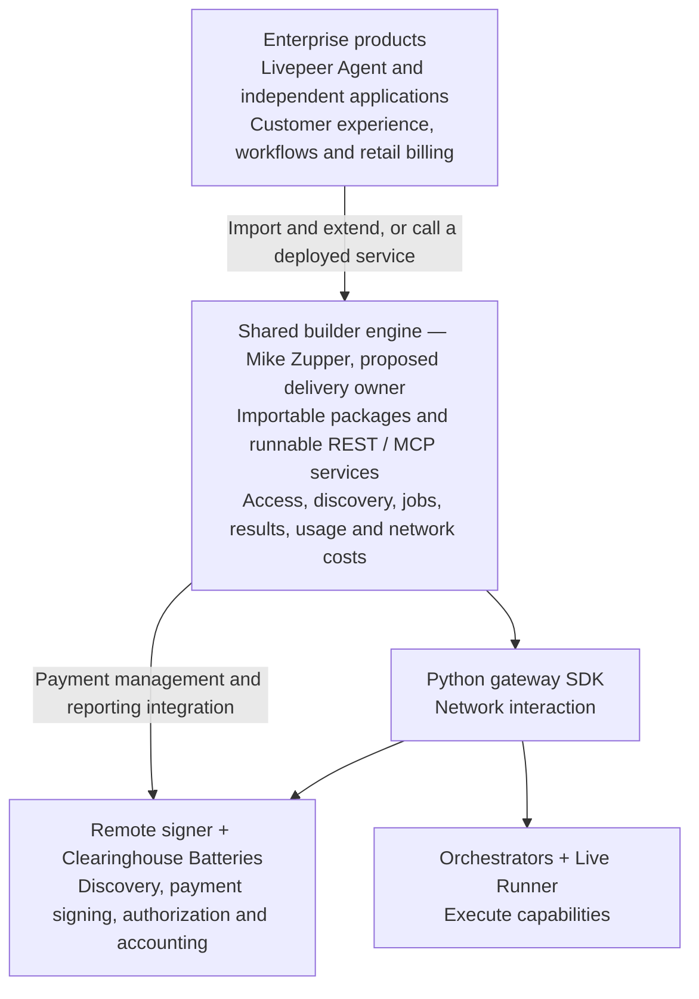

# Self-Sovereign Open Builder Stack

**Status:** Consolidated working proposal, not SPE-approved architecture or implementation\
**Updated:** 25 September 2026\
**Proposal and interim new-repository owner:** Mike Zupper

## Executive summary

**Proposal:** Mike Zupper proposes to deliver a reusable open-source builder engine as
his contribution to the Network Engineering SPE Build Track. It will give
application builders a common way to discover network capabilities, understand
network prices, execute jobs, receive results, and inspect usage and network
costs. Livepeer Inc and other builders can reuse this foundation while developing
their own products. The 24 September sync established conceptual alignment;
this document requests review of the delivery boundaries and architecture.

### Architecture at a glance

The architecture has three layers: enterprise products, the shared builder
engine, and existing network/payment components. The engine connects these
components and provides a consistent developer experience.

Arrows show proposed responsibilities, not a verified request sequence. REST
provides an HTTP interface for applications; MCP exposes the same core functions
to agent tools. Builders can embed the packages or run the supplied services.
Enterprise extensions add their own authentication, tools and business logic.

### Components, repositories and ownership

The table describes proposed delivery responsibility. Existing repositories
retain their own maintainers and approval processes; named coordination contacts
do not imply new maintenance or delivery commitments.

| Component / repository | Responsibility | Ownership and handoff |
| --- | --- | --- |
| **New builder-engine repository** — name pending; intended future Livepeer organization home | Shared packages, REST/MCP services, SDK/payment adapters, job and usage records, packaging and documentation | **Mike Zupper:** proposed delivery lead and interim repository owner; long-term maintenance and transfer require agreement |
| **Reference application** — location pending | Demonstrate package extension and service integration, with a Console-informed UI and mock commerce | **Mike Zupper:** proposed owner of example delivery; final placement and feature selection need review |
| [livepeer-python-gateway](https://github.com/livepeer/livepeer-python-gateway) | Reused Python SDK for network discovery, rates and job invocation | Upstream maintainers retain SDK ownership; Mike Zupper owns its integration and compatibility evidence; confirm upstream change owners with Josh |
| [go-livepeer](https://github.com/livepeer/go-livepeer) | Remote signer and Orchestrator / Live Runner integration | Upstream network/runtime maintainers; **Josh is the network/Operate Track coordination contact** identified in the meeting; required changes need owner agreement |
| [clearinghouse-batteries](https://github.com/livepeer/clearinghouse-batteries) | Reused payment authorization, allocations and network accounting | Upstream maintainers; **Josh is the payment-core coordination contact**; provisioning/reporting additions require agreement |
| **Inc capability schema and SDK REST wrapper** — source access pending | Candidate source for common capability descriptions and reusable SDK service behavior | **Qiang / Inc:** offered source access; **Mike Zupper:** evaluate reuse with the owners before fixing shared contracts |
| [console](https://github.com/livepeer/console) | Existing prototype supplying reference behavior and potentially reusable code | Reported as Foundation-held in the meeting; Mike Zupper proposes selected reuse; archive/retrofit decisions remain with its owners |
| **Enterprise applications** — independently owned repositories | Product experience, customer identities, workflows, retail pricing and billing | **Inc owns its Agent product; other builders own theirs.** Integration and migration timing remain their decisions |

### Software delivery and service operation

The shared engine reports **wholesale network costs**. Each enterprise defines
its **retail customer charges**, subscriptions and commercial policies. Network
payment accounting remains with Batteries/the payment provider; the engine
correlates that evidence with its job records.

Two payment deployment choices are supported by the proposal. A self-operating
organization runs and funds its signer and Batteries. A walletless builder uses
a credential from a hosted payment operator that takes on those responsibilities.
Both use the same builder engine. **A public walletless service still needs a
named operator, funding, access policy and support commitment.** The meeting did
not assign that service to Inc or Mike Zupper. Hosting the engine is also the
responsibility of whoever deploys it.

### What stakeholders are being asked to review

Confirm the shared-core/enterprise boundary, Mike Zupper's proposed engine and
reference-app deliverables, and the upstream handoffs in the table. Identify
owners for required SDK/payment changes and for any hosted walletless offering.
Agree acceptance around a working journey from credential and discovery through
execution, results and understandable network-cost reporting, demonstrated in
both package and service integration modes. Final milestones follow that scope
review; Inc adoption is not an acceptance dependency.

The technical sections below define the proposal and its unresolved interface
and deployment choices. Detailed component flows are in the
[diagram companion](open-builder-architecture-and-sequences.md); implementation
evidence and gaps are in the [capability matrix](console-capability-and-gap-matrix.md).

## Purpose and source precedence

This is the primary architecture proposal for Mike Zupper's contribution to the
Build Track. The [diagram companion](open-builder-architecture-and-sequences.md)
illustrates this proposal; the [capability matrix](console-capability-and-gap-matrix.md)
contains pinned source evidence. Earlier intermediate proposals were removed
following consolidation. The approach evolved from a full commercial Console
replacement, to a noncommercial Console-hosted backend, to the current separate
package/service repository. It also expanded from HTTP-only enterprise access
to imported extensions, with enterprise-deployed OSS inside its trust boundary.
Those earlier implementation assumptions are superseded; original stakeholder
evidence is preserved.

Inputs include the [21 September Josh conversation](../references/stakeholder-input/meetings/2026-09-21-Mike-Josh-Clearinghouse-Batteries-Conversation.md),
the [23 September John–Mike transcript](../references/stakeholder-input/meetings/john-mike-build-track-architecture-discussion-0923-2026.txt),
Mike's subsequent proposal clarifications, and the
[24 September Agent–Network Engineering SPE sync](../references/stakeholder-input/meetings/09-24-2026-Livepeer-Inc-Agent-Team-NE-SPE-sync-meeting.txt). In the 23 September transcript, Speaker 1 appears
to be Mike and Speaker 2 John from context; the supplied transcript ends mid-topic
at 01:28:55. Reported software limitations and third-party commitments are not
verified by meeting agreement. Personal commentary is not architectural evidence.

Mike's subsequent direction establishes the proposal below. It does not assign
work to other SPE participants or establish programme-wide approval. Production
facts require repository/deployment evidence; source inspection is not a runtime
integration test. Final schemas, capability coverage, delivery assignments and
external commitments remain subject to owner and SPE review.

## 24 September alignment and source handoffs

The [supplied sync transcript](../references/stakeholder-input/meetings/09-24-2026-Livepeer-Inc-Agent-Team-NE-SPE-sync-meeting.txt)
supports conceptual alignment on shared capability descriptions, discovery,
pricing, execution and usage, with enterprise product concerns above that layer.
Peace restates the common capability contract at 15:00–16:09; Josh supports the
wholesale/retail distinction at 20:10–21:41. At 48:44–51:52, Qiang offers the
existing capability schema and SDK REST wrapper and supports a common approach.
Rich recaps the source-access handoff at 53:48 and 1:00:19. Source access and any
permission to redistribute extracted code still need confirmation; an offer to
share is not evidence that access or an open-source release has occurred.

Review those implementations with their owners before fixing shared schemas or
package boundaries. Preserve compatible behavior where practical, separate
product-specific concerns through extension interfaces, and validate a common
end-to-end integration. Inc can continue its product work during this process;
its eventual adoption and migration timing require a separate agreement.

At 54:50–55:52, Inc participants report that their current Agent effort uses
Batteries and distinguish it from the earlier PymtHouse-dependent Console
prototype. This is reported direction, not newly verified code evidence. The
pinned Console review remains a reference for selected behavior, not a claim
about Inc's current stack. The 57:39–59:22 discussion supports retaining its value
as an example; it does not settle retrofitting that repository versus creating
the proposed sample application.

At 1:00:19, architecture circulation and review are explicitly the next step.
Conceptual alignment does not settle detailed interfaces, hosted-service
operation, upstream delivery commitments or final SPE acceptance.

## Selected direction

The deliverable is a reusable, noncommercial builder engine with installable
packages and runnable REST and MCP services. Enterprises can import and extend
its public interfaces or call it as a deployed service, without modifying core
source. REST and MCP share core behavior. Console supplies reference behavior
and code to extract or redesign; a Console rewrite is not the delivery premise.

Self-sovereign means independent installation, operation, data control,
credential administration, upgrades and recovery. Operators can run Batteries
and the signer themselves, including funding the signer wallet, or delegate
payment operations to a third party. Hosted access transfers funding and
availability responsibility; it does not provide the same control as self-operation.
For hosted access, the operator must be named and agree funding, credential
issuance, usage policy, abuse controls, availability and support responsibilities.
A reference deployment demonstrates integration; it does not establish an ongoing
public service. Neither Inc nor Mike Zupper is assigned that operation by this
proposal or by the 24 September meeting.
Neither mode requires PymtHouse, a proprietary identity provider, or commerce.
Network, chain RPC and payment funding remain explicit dependencies.

## Repositories and application roles

The [executive component map](#components-repositories-and-ownership) owns the
repository and responsibility inventory. Reuse of the Python SDK requires
verification against the selected Console execution baseline; it is not a
presumed replacement for Console's TypeScript gateway dependency. Batteries
remains a narrow payment core, and its proposed management/reporting integration
requires maintainer agreement. Payment-protocol redesign is outside this scope.

A repository is not necessarily a process. A Python core is the working
implementation direction; exact package boundaries and MCP/runtime packaging
remain design details to resolve. The SDK adapter may run in-process or as a
worker where execution lifetime requires it. No additional worker service is
mandated solely by the architecture diagram.

## Shared core and extension boundaries

| Capability | Core responsibility | Enterprise or example responsibility |
| --- | --- | --- |
| Access | Validated internal actor/context, ownership checks, credential lifecycle and service trust | Customer identities, Google login/SSO, entitlement policy |
| Discovery and prices | Supported capabilities, input descriptions, network rates, units and freshness | Product catalog presentation, retail prices and markup |
| Execution | SDK integration, jobs/attempts, status, result references and understandable failures | Application workflows and additional tools |
| MCP and REST | Two interfaces to shared core services and authorization rules | Add endpoints/tools and integrate enterprise authentication without forking core |
| Usage and cost | Execution measurements and correlated network-cost projections with uncertainty | Retail metering policy, subscriptions, invoices, refunds and margin reporting |
| Payments | Adapter to authorized provisioning/reporting and signing interfaces | Choose provider or self-operation; fund signer independently of customer billing |
| Persistence | Engine-owned records and supported persistence interface | Customer/commerce stores, analytics and external-ID mappings |

No required project, CRM, retail wallet, subscription engine or asset-management
product is introduced into core. Basic inputs/results are necessary; general
media libraries and application-specific MCP tools belong to extensions.

### Package and service integration

An enterprise can import released core packages into its backend and MCP host,
add its own endpoints/tools, and supply supported identity/policy integrations.
Alternatively, it can deploy the supplied REST/MCP service and use authenticated
calls and reporting events. Both modes reuse the same core release and behavior.
Public extension interfaces must be versioned and tested. Private internals or
source patches are not an acceptable integration contract.

Enterprise-owned code runs under enterprise operational responsibility. It must
not directly rewrite the engine's tables or Batteries' ledger. No arbitrary
plugin marketplace or runtime code-loading framework is required. A frontend
wrapper still needs scoped browser access through an appropriate backend or
trusted authentication layer; provider/admin credentials stay server-side.

### Access recommendation awaiting disposition

Recommend operator-issued scoped API keys as the standalone REST/remote-MCP
baseline, with opaque actor identifiers, revocation, ownership isolation and a
separate administrator credential. Enterprise authentication supplies the same
validated access context through a supported adapter. Google login and MCP OAuth
can be demonstrated in the example without becoming mandatory core identity
infrastructure. This recommendation has not yet been explicitly selected by Mike.

Claude Code, Codex CLI and OpenCode document header/bearer credentials and OAuth:
[Claude Code](https://code.claude.com/docs/en/mcp),
[Codex](https://learn.chatgpt.com/docs/extend/mcp?surface=cli),
[OpenCode](https://opencode.ai/docs/mcp-servers/), reviewed 23 September 2026.
These documented options do not prove our implementation interoperates; test
pinned client versions. Browser sessions and public exposure require a defined
trust model. An unauthenticated local test is not a public deployment profile.

Customer login tokens do not need to reach the payment provider. Keep configured
service payment credentials separate from engine/user access, and correlate
opaque job/attempt/payment references. Per-application versus per-actor payment
allocations remain a contract decision; onboarding a customer need not create a
provider account or allocation for that customer.

## Execution baseline and streaming decision

Mike requires the new backend to support Console's current execution behavior.
The pinned review baseline is Console `009a703d7b6434bab905902375f562e5980728af`.
Source evidence establishes invocation paths for single-shot requests, queued
asynchronous completion/recoverable handles, and persistent application endpoints.
`lib/mcp/mcp-server.ts`, `lib/mcp/run-capability.ts` and `lib/mcp/gateway.ts`
are the principal source locations; runtime parity through the Python SDK still
needs runtime integration verification.

Persistent applications are not necessarily streaming jobs. MCP progress/SSE
messages are not proof of incremental inference output or live media transport.
Additional incremental text streaming and continuous live audio/video are an
open scope decision, not committed delivery requirements.
This does not block defining or implementing verified baseline behavior.
Select representative supported capabilities and pin all participating revisions
before accepting parity. Preserve failure, timeout and uncertain-result behavior;
a retry must not silently duplicate work or payments. Session/price changes are
validation cases, not grounds to assume undocumented signer guarantees.

## Persistence and accounting authority

SQLite plus an explicit persistence interface is the required minimum.
PostgreSQL is a delivery target, not a condition that replaces that minimum.
Both should implement the same contract for engine-owned access mappings,
jobs/attempts, result references, measured usage and cost projections, including
migrations and backup/restore. Retention must be configurable.

Enterprises can correlate stable engine identifiers with their own stores and
consume versioned events into billing/analytics. Supporting arbitrary enterprise
database schemas is not required. A PostgreSQL adapter alone does not prove
multi-instance scheduling, concurrency safety or high availability.

| Record | Authority | Meaning |
| --- | --- | --- |
| Job inputs/outputs, status and measured work | Engine/SDK execution path | What was attempted and observed; quantities only where supported |
| Allocations and ticket expected-value accounting | Batteries/payment provider | Network payment permission and observed ticket cost |
| Winning-ticket redemption | Payment operator settlement evidence | On-chain settlement; not an exact per-job cash receipt |
| Customer bill and commercial balance | Enterprise | Retail price/policy independent of network ticket settlement |

Engine reporting is a projection, not a second authoritative network ledger.
Correlate jobs, attempts, payment sessions/manifests and events explicitly; do not
assume these identifiers are interchangeable. Missing or delayed evidence is
pending/unknown, never automatically zero. Network expected-value accounting,
settlement and retail charges must remain visibly distinct.

Proposed provider management/read APIs need scoped authorization, exact units,
idempotency and stable references. Proposed reporting events need stable IDs,
versioned schemas, replay cursors and consumer deduplication. End-to-end event
completeness remains unproven. A replayable backend feed cannot recover evidence
that an upstream producer never delivered.

Allocations do not fund signer escrow. Existing evidence does not establish
strict spend reservations or hard ceilings. Revoking future access does not
reverse issued tickets, remove late fees or guarantee job cancellation. Hosted
provider switching may require credential replacement, allowance reconciliation
and handling outstanding jobs; an adapter does not make migration automatic.

## Examples and seven outcomes

The sample should offer a useful Console-informed baseline: access, discovery,
prices, invocation, results/history, usage/cost and administrative allowance
management. Demonstrate adding enterprise authentication, additional endpoints
and MCP tools, and mock commerce without changing core source. Use one example
with imported-extension and separate-service variants where practical.

Full production commercial parity is not required. Mock purchases, entitlements
and invoices can exercise integration behavior; no working Stripe checkout or
Stripe test-account dependency is necessary. Enterprises implement real commerce.
Exact selection of Console UI/asset/account features remains part of the matrix
review rather than an implicit promise to copy every screen.

| Builder outcome | Responsibility |
| --- | --- |
| 1. Obtain one credential | Operator/application access flow; underlying payment credentials hidden |
| 2. Discover capabilities | Shared core using SDK/signer evidence |
| 3. Understand expected rate | Network rate/units/assumptions; enterprise defines retail price |
| 4. Invoke a capability | REST or MCP backed by the same core and SDK |
| 5. Receive result or understandable failure | Durable job/result/failure behavior |
| 6. Pay without holding crypto | Operator/provider-funded signer plus Batteries authorization |
| 7. See usage and resulting charge | Core usage/network-cost evidence; enterprise supplies retail bill if applicable |

Standalone “charge” is proposed as network cost against assigned allowance. Any
SPE requirement for actual customer purchases or invoices must be explicitly
assigned to an external integration, not silently added to core.

## Delivery and acceptance

Architecture and scope review precede final October–December milestone
commitments.
Acceptance evidence should cover:

- A pinned seven-outcome journey with no mandatory PymtHouse or commerce service.
- Console execution baseline through the Python SDK, with representative success,
  failure, queued recovery and restart behavior.
- The same core package release used by standalone and imported enterprise modes;
  shared REST/MCP behavior, ownership isolation and added enterprise tools.
- Mock commerce disconnected from normal standalone operation, retry-safe commands,
  late/unmatched costs, duplicate events and replay without double application.
- SQLite persistence, migrations and backup/restore; equivalent PostgreSQL contract
  checks if included, without implying HA merely from database choice.
- Documented self-operated and hosted payment configurations, with upstream API
  gaps and provider obligations identified rather than invented.
- Package and container builds, install/start smoke checks, automated tests,
  lint/type checks, versioned release artifacts and release documentation.

Mike manages the new repository initially. CI/build/release preparation is
required before eventual transfer to the Livepeer GitHub organization. Automated
release workflows should use controlled credentials and explicit release triggers;
this documentation does not authorize creating, publishing or transferring repos.
Long-term maintainers, licenses for reused code, release ownership and upstream
contribution agreements must be settled with the relevant owners.

## Decision boundaries

Selected by Mike for the proposal: new backend repository, installable packages
and runnable services, imported and HTTP enterprise integration, noncommercial
core, mocked example commerce, Console execution baseline, SQLite/persistence
minimum, PostgreSQL target, and interim ownership/release preparation.

Still unresolved: exact access/OAuth profile, payment credential/allocation
granularity, provider provisioning/reporting contracts, example feature selection
and repository placement, execution-process packaging, extra streaming scope,
PostgreSQL delivery commitment, supported deployment guarantees, ongoing owners, a funded hosted-access operator
and final SPE scope/acceptance. The meeting evidence does not establish Inc adoption or
obligate Josh/John to particular upstream changes. Preserve these distinctions
when deriving milestones or presenting the proposal for approval.
