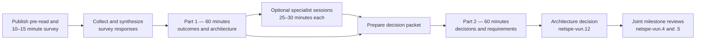

# Build Track Architecture Alignment Process

**Status:** Planning draft

**Prepared:** 26 August 2026

**Owner:** Mike Zupper

**Scope:** Cloud SPE preparation for Network Engineering SPE Build Track
architecture and milestone discussions

**Preparation bead:** `netspe-vun.8`

## Purpose

This document defines the process for turning the Build Track's intended
builder outcomes into an agreed, Live Runner-centric end-state architecture and
then into reviewable September–December 2026 milestone requirements. It is a
facilitation and scheduling guide, not an architecture decision or an approved
Cloud SPE scope of work.

The process is designed to prevent three failure modes:

- approving milestones before the target architecture and repository
  boundaries are known;
- treating the current-state component diagram as an accepted target design;
  and
- assigning programme-wide, cross-track, or externally owned work to the Cloud
  SPE without an explicit decision.

## Required builder outcomes

Every stage of the process must preserve and test the seven builder outcomes. A
builder should be able to:

1. Obtain one credential.
2. Discover what the network can do.
3. Understand the expected price or rate.
4. Invoke a capability through a standard interface.
5. Receive a result or understandable failure.
6. Pay without holding crypto.
7. See their usage and resulting charge.

The workshops must map every outcome to a builder-facing interface,
authoritative component, repository, owner, and observable completion evidence.

## Scope guardrails

Live Runner is the proposed execution focus for the September–December 2026
work. The following execution paths are explicit non-goals for the proposed
target architecture unless the Network Engineering SPE changes the scope:

- batch AI;
- bring your own container (BYOC);
- live video-to-video (LV2V); and
- transcoding.

These paths may remain in the current-state diagram when needed for accuracy,
but they must be visually and verbally separated from the target scope.

Demand generation and application adoption are also excluded from the Build
Track. The architecture process must not introduce application counts, traffic
targets, or live-demand evidence as delivery or acceptance requirements.
Sample or reference applications and runnable examples may demonstrate the
supported interfaces or provide controlled integration evidence, but they are
documentation and validation aids rather than adoption, production-demand,
funding, or ongoing-operation commitments.

Live Runner focus does not remove the builder-facing and control-plane systems
from discussion. Agent 2.0/Storyboard, SDKs, SDK Service, gateways, identity,
ServiceRegistry contracts, discovery, clearinghouse and signer services,
pricing, errors, metering, usage, and charges all remain relevant to the seven
outcomes.

## Process at a glance

Optional specialist sessions are activated only when Part 1 identifies a
factual or ownership gap that prevents Part 2 from making a responsible
decision.

## Time-box policy

All scheduled discussion blocks must be one of the following lengths:

- 10–15 minutes for a focused question, review, or decision; or
- 25–30 minutes for a large architectural topic.

No agenda uses five-minute or other smaller increments. Survey completion is
limited to 10–15 minutes. Part 1 and Part 2 are each 60 minutes. Specialist
sessions are 25–30 minutes.

## Participants and roles

| Participant | Meeting role | Expected authority or knowledge |
| --- | --- | --- |
| Mike Zupper | Facilitator and Build Track/Cloud SPE representative | Builder outcomes, Cloud SPE boundaries, proposed milestones, decision capture |
| Rick Staa | Network Engineering technical gate | Foundation technical direction, `go-livepeer` gates, cross-repository review and escalation |
| Josh Allmann | Architect/technical lead and Operate Track representative | Live Runner, Orchestrator architecture, registry/discovery boundary, Livepeer Inc gates |
| John Mull or Elite Encoder representative | Optional specialist | Hosted Pymthouse implementation, operation, and relationship to `livepeer/clearinghouse` |
| Agent 2.0/Storyboard owner | Optional specialist | Agent role, SDK Service, registry projection, pricing, errors, usage and cost reporting |
| Other repository owners | Invited when identified | Deployed behavior, repository approval, delivery feasibility |

Participation in a workshop does not automatically give an attendee authority
to approve Network Engineering SPE or Cloud SPE scope. Every recorded decision
must name its authority and any further sign-off required.

## Scheduling sequence

| Relative timing | Activity | Scheduling rule |
| --- | --- | --- |
| Five business days before Part 1 | Send pre-read, survey, and tentative Part 2 hold | Keep the architecture survey separate from the availability poll |
| Two business days before Part 1 | Close survey responses | Allow synthesis time; late responses become meeting inputs rather than delaying synthesis |
| One business day before Part 1 | Distribute survey synthesis and final Part 1 agenda | Highlight disagreements, unknowns, and authority gaps rather than averaging responses |
| Part 1 | Outcomes and architecture workshop | 60 minutes: 15 + 15 + 30 |
| Following three to five business days | Specialist sessions and decision-packet preparation | Each specialist session is 25–30 minutes |
| Part 2 | Decisions and requirements workshop | 60 minutes: four 15-minute blocks |
| Within two business days after Part 2 | Circulate decision record and proposed architecture | Require corrections to facts separately from objections to decisions |
| After architecture confirmation | Revise milestone proposal for joint SPE review | Existing approval gates remain blocked until prerequisite decisions are resolved |

Part 2 should be tentatively scheduled when Part 1 is scheduled. It may be
moved if required specialist evidence is unavailable, but it should not be left
unscheduled until after Part 1.

## Planning package

- [Architecture survey](Build-Track-Architecture-Survey.md)
- [Workshop Part 1: outcomes and target architecture](Build-Track-Architecture-Workshop-Part-1.md)
- [Workshop Part 2: decisions and requirements](Build-Track-Architecture-Workshop-Part-2.md)
- [Current-state repository traceability and component diagram](Build-Track-Repo-Traceability.md)
- [Draft Cloud SPE milestones](../design-docs/cloud-spe-september-december-2026-milestones-draft.md)
- [Build Track outcome and high-level concepts](Build-Track-Outcome-and-High-Level-Concepts.md)

## Clearinghouse terminology that must remain unresolved

The process must distinguish at least three possible directions:

1. Elite Encoder's hosted clearinghouse known as Pymthouse.
2. The implementation in the `livepeer/clearinghouse` Git repository.
3. A new Build Track implementation, if an agreed requirement cannot be met by
   either existing option.

The relationship between hosted Pymthouse and `livepeer/clearinghouse` must not
be asserted without confirmation. The survey and workshops must establish
whether they share code, whether one is a fork or reference implementation, who
owns and operates each, and which is intended for production use.

## Registry and discovery terminology

The process must keep these responsibilities distinct:

- the on-chain ServiceRegistry used as a durable Orchestrator identity and
  service-URI source in the current implementation;
- gateway or client discovery of candidate Orchestrators;
- runtime `GetOrchestrator` information such as capabilities, constraints,
  hardware, ticket parameters, and prices;
- an Orchestrator-local Live Runner registry populated through static
  configuration or heartbeat; and
- any builder-facing catalog or aggregated network view.

Whether capabilities or prices should move on-chain is an open target-design
question. The current implementation must not be mistaken for the required
future design.

## Decision classification

Every workshop conclusion should be recorded as one of:

| Classification | Meaning |
| --- | --- |
| Confirmed fact | Verified against an authoritative repository, deployment, owner, or accepted source |
| Working assumption | Used temporarily and assigned an owner and review date |
| Proposed decision | Preferred direction that still needs named authority to approve it |
| Accepted decision | Approved by the named authority and suitable to constrain milestones |
| Escalation | Cannot be decided by attendees; names the required authority and due date |
| Out of scope | Explicitly excluded from the September–December target |

Silence, lack of objection, and survey plurality do not constitute an accepted
decision.

## Required end products

The process should produce:

- a corrected current-state architecture diagram;
- a Live Runner-centric target architecture diagram;
- an outcome-to-component and outcome-to-evidence matrix;
- a component classification showing what remains, changes, is replaced, or is
  out of scope;
- a clearinghouse decision or a time-boxed evaluation with named authority;
- a ServiceRegistry, runtime discovery, gateway selection, and Live Runner
  registration decision;
- a repository owner and approver map;
- a list of external dependencies and specialist follow-ups;
- revised milestone requirements and acceptance evidence; and
- an architecture decision suitable for `netspe-vun.12`.

## Beads workflow

| Bead | Durable outcome |
| --- | --- |
| `netspe-vun.8` | Prepare and validate this planning package |
| `netspe-vun.9` | Collect and synthesize survey responses |
| `netspe-vun.10` | Conduct Part 1 and record its outputs |
| `netspe-vun.11` | Conduct Part 2 and record its outputs |
| `netspe-vun.12` | Confirm the end-state architecture |
| `netspe-vun.7` | Resolved: exclude demand generation and application adoption from the Build Track |
| `netspe-vun.4` | Network Engineering SPE milestone approval after prerequisite decisions |
| `netspe-vun.5` | Cloud SPE milestone approval after prerequisite decisions |
| `netspe-vun.6` | Publish the jointly approved milestone plan |

The application-adoption decision remains separate from architecture and is
closed. The workshops may discuss voluntary reference integrations, but they
must treat the absence of demand-generation and application-adoption
requirements as a fixed scope guardrail.
