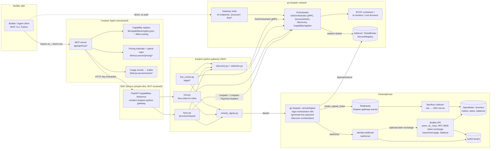

# Build Track: Repository Traceability and Gap Analysis

**Status:** Working draft
**Date:** 24 August 2026
**Track:** Easy to Build — Builder
**Track owner:** Mike Zupper
**Companion to:** [Build Track: Outcome and High-Level Concepts](Build-Track-Outcome-and-High-Level-Concepts.md)

## Purpose

The Outcome document states what must be true for a builder by 31 December 2026. This document traces each of those statements to a feature or function that exists today in the four repositories that make up the builder path, and records where nothing exists, where two components do the same thing differently, or where components contradict each other.

This is a current-state traceability report, not an accepted end-state
architecture. The architecture-alignment process proposes Live Runner as the
execution focus and treats batch AI, BYOC, LV2V and transcoding as target-scope
non-goals. Those paths remain in this report only because they exist in the
current code and help explain present duplication and gaps.

Every claim below cites a file path in the repository as checked out on 24 August 2026. Repositories reviewed:

| Repo | Local checkout | Branch / last commit | What it is |
| --- | --- | --- | --- |
| **Livepeer Agent** (`livepeer/storyboard`) | `~/git-repos/livepeer-agent-2.0` | `main`, 2026-08-24 (`739ab8e`) | Next.js/TypeScript app + MCP server + CLI, deployed at agent.livepeer.org. ~256k LOC. |
| **Clearinghouse repository** (`livepeer/clearinghouse`) | `~/git-repos/livepeer-cloud-spe/livepeer-clearninghouse` | `main`, 2026-08-20 (`b604893`) | Docker Compose implementation: identity webhook (Node), go-livepeer remote signer, Redpanda/Kafka, Benthos → OpenMeter collector, Go Builder API, Auth0/Konnect provisioners. Its relationship to Elite Encoder's hosted Pymthouse clearinghouse is not verified. |
| **go-livepeer** (`livepeer/go-livepeer`) | `~/git-repos/go-livepeer` | `master`, 2026-08-18 (`176aa415`) | The network node binary: gateway, orchestrator, AI worker, remote signer, redeemer. |
| **Python gateway SDK** (`livepeer/livepeer-python-gateway`) | `~/git-repos/livepeer-cloud-spe/livepeer-python-gateway` | `main`, 2026-08-12 (`44df061`), v1.0.0 | Pure client SDK (`pip install livepeer-gateway`) that acts as its own gateway: talks gRPC/HTTP to orchestrators and HTTP to a remote signer. |

**A fifth component is on the critical path but in none of these repos:** the **SDK Service** (`sdk.daydream.monster`, a Python FastAPI app in `simple-infra` that vendors the Python gateway SDK and fronts the BYOC orchestrator and fal.ai adapter). The Agent calls only this service. It is referenced in `livepeer-agent-2.0/CLAUDE.md:156-230` and `agent.md:129-132` but its code was not reviewed. Similarly the **discovery-service** (`discovery-service-production-8955.up.railway.app`) that the clearinghouse hands to clients is external.

Elite Encoder's hosted clearinghouse, referred to as **Pymthouse**, must also be
treated as a distinct named system until its codebase, deployed revision,
ownership, and relationship to `livepeer/clearinghouse` are confirmed. This
review inspected the Git repository and must not be read as verification of the
hosted Pymthouse deployment.

## Component diagram

Solid lines are paths that exist in code today. Dashed lines are optional or flag-gated. Note that **the Agent's production path and the clearinghouse path do not connect**: the Agent's key is a Daydream `sk_` key cleared by `signer.daydream.live`, and the Agent has no references to Auth0, the identity webhook, or OpenMeter (`livepeer-agent-2.0`: zero hits for Auth0; OpenMeter only in planning docs). The clearinghouse has zero references to the Agent.

## Per-repository summaries

### Livepeer Agent (storyboard)

- **Role in the builder path:** the reference demand source and, in practice, the only builder-facing product surface. Exposes an MCP server (`app/api/mcp/{raw,creative,full}`, `lib/mcp-server/server.ts`), a CLI (`packages/agent`), and REST proxies (`app/api/capabilities/*`).
- **Network access:** never talks to go-livepeer directly. All inference is HTTP to the SDK Service (`lib/sdk/client.ts:39-65`, `lib/mcp-server/sdk-call.ts`; base URL default `https://sdk.daydream.monster`, `lib/sdk/provider-server.ts:50`). Only exception is the operator-only billing proxy `app/api/billing-events/route.ts:28` to the BYOC orchestrator's `/admin/billing-events`.
- **Credential:** any ≥16-char bearer is accepted (`lib/mcp-server/auth.ts`, `key-validation.ts:50-58` recognises `sk_`, `naap_`, `pmth_`, `app_*_pmth_*`). Only Daydream `sk_` keys actually clear payment today (`CLAUDE.md:222`: "Without the Daydream API key, ALL inference fails (signer 401)"). Keyless demo mode substitutes a server key with a Blob-backed spend ledger (`demo-budget.ts`). OAuth/NaaP/pymthouse credential paths exist but are flag-gated and blocked upstream (`PYMTHOUSE-PAYMENT-BLOCKER.md`).
- **Capabilities:** three layers — live list from SDK `/capabilities` (`lib/sdk/capabilities.ts:119`, 60s cache in `capabilities-cache.ts`), a committed 200-entry `lib/capabilities/registry.json` with SLA/fallback/usage/pricing metadata, and a mutable Blob overlay (`registry-overlay.ts`). A Zod "Capability Descriptor" standard (`lib/capabilities/descriptor.ts`, `standard.ts`) and a cron that syncs descriptors from orchestrator `/discovery` (`discovery-sync.ts`, default off).
- **Pricing:** pre-execution estimate `display_price_usd × estimated_units` (`lib/mcp-server/pricing/estimate.ts`, `get_pricing` tool, `dispatch-quote.ts`), per-bearer 24h spend cap (`tools/spend-cap.ts`, default $50). Post-execution realized cost from adapter-forwarded `billable_units` (`pricing/realized-cost.ts`); `get_cost_report` tool; job records carry `cost_usd_estimated` and `cost_paid_usd` (`storage.ts:1219,1247`).
- **Errors:** structured envelope `{code, message, hint, retryable, retry_after_seconds}` (`errors.ts`) with a closed code union including a `billing_note` per code (`failure-codes.ts`).
- **Attribution:** rich `UsageEvent` (`events/types.ts`: principal, surface, agent, tool, capability, cost_usd, job_id, utm attribution) exported to Confluent `network_events` topic (`events/sink.ts`, env-gated). Orchestrator attribution via hardcoded hostname map (`lib/attribution/resolve.ts:67-86`).

### Clearinghouse

- **Role:** turns a go-livepeer remote signer into a multi-tenant walletless payment layer. One custodial ETH key signs tickets for all tenants; identity is resolved by webhook; fees are metered into OpenMeter in USD.
- **Components** (`docker-compose.yml`): `identity-webhook` :8090 (`/authorize`, returns `auth_id = client_id:usage_subject`, `protocol.mjs:137-145, 282-341`), `remote-signer` :8081 (go-livepeer image pinned by SHA, `remote-signer/Dockerfile:8`, flags in `entrypoint.sh:26-60`), `kafka` (Redpanda in dev mode, `kafka/entrypoint.sh:16-22` "Not for production!"), `openmeter-collector` (Benthos `collector.yaml:107-250` + Go `builder-api` :8095).
- **Credential issuance:** Builder API `POST /api/v1/apps/{clientId}/users` creates an Auth0 user + OpenMeter customer and returns an `sk_…` key once (`server.go:215-278`). `POST /api/v1/oidc/token` (RFC 8693) exchanges `sk_` or Auth0 user JWT for a signer JWT and returns `signer_url`, `discovery_url`, `balance_usd_micros`, `has_access` (`tokenexchange/handler.go:83-152`); can 402 on insufficient allowance when `OPENMETER_ENFORCE_ALLOWANCE` is set.
- **Metering:** only `create_signed_ticket` Kafka events are consumed; converted to CloudEvents with `network_fee_usd_micros` (Coinbase spot at ingest), dimensions `client_id`, `external_user_id`, `pipeline`, `model_id`, `manifest_id` (`collector.yaml:186-214`, `catalog.json:143-220`). Builder-facing `GET /api/v1/users/me/usage` and `/balance` (`admin.go:69-151`).
- **Not implemented / stubbed:** live balance gate in webhook is wired only to a fixed `DEMO_BALANCE_USD_MICROS` (`server.mjs:24-51`); phase-2 markup unimplemented (`collector.yaml:199-201`); trial grant off by default; top-ups manual via Konnect UI; default plan key `clearinghouse_default_ppu` (`.env.example:87`, `config.go:52`) does not exist in `catalog.json`.

### go-livepeer

- **Role:** the network. Gateway mode serves builder-facing HTTP; orchestrator mode serves jobs and accepts PM tickets; remote-signer mode separates key custody from the gateway (`core/livepeernode.go:53,63`).
- **Builder-facing endpoints on a gateway** (`server/ai_mediaserver.go:83-123`, `byoc/byoc.go:166-182`): batch AI (`/text-to-image`, `/llm`, …, OpenAPI-validated), live `/live/video-to-video/{stream}/start`, BYOC `/process/request/{capability}` and `/process/stream/*`, transcoding `/live/`. **No authentication on any of them**; only per-stream auth webhooks (`-liveAIAuthWebhookUrl`, `server/auth.go:136-155`).
- **BYOC model:** orchestrator registers an external capability at `/capability/register` with name/url/capacity/price (`core/external_capabilities.go:17-25`, auth = `-orchSecret`). Gateway fans out `GET /process/token` to its pool, gets `JobToken{ticket_params, balance, price, service_addr, available_capacity}` (`byoc/types.go:132-143`), signs `request+parameters` with the **gateway's own ETH key** (`byoc/utils.go:33-51`), forwards with `Livepeer` + `Livepeer-Payment` headers; orchestrator charges by compute seconds and returns `Livepeer-Balance` (`byoc/job_orchestrator.go:295-343, 526-530`).
- **Discovery:** on-chain ServiceRegistry / webhook / static list (`discovery/`), `GetOrchestrator` gRPC returns `OrchestratorInfo` with capability bitset, per-model constraints, `price_info`, `capabilities_prices` (`net/lp_rpc.proto:102-186`); BYOC prices appear as `Capability_BYOC(37)` + `Constraint=<name>` (`core/orchestrator.go:317-339`). Aggregated `/getNetworkCapabilities` exists only on the CLI port (`server/handlers.go:275-296`). Remote signer `/discover-orchestrators` is documented as "not intended to be exposed to end-users" (`doc/remote-signer.md`).
- **Remote signer:** `POST /sign-orchestrator-info`, `POST /generate-live-payment` (`type` = `live|lv2v|fixed`, `maxPrice`, `app`, `capabilities`; `server/remote_signer.go:80-92, 171-195`), policy webhook returning `{status, reason, expiry, auth_id, maxPrice}` (`remote_signer.go:209-220`). **Scope is live video-to-video and Live Runner payments only** (`server/ai_process.go:1056,1700`, `live_payment.go:180-294`). Batch AI, transcoding and BYOC still sign with the local gateway key.
- **Pricing units:** pixels (`-pricePerUnit/-pixelsPerUnit`), compute seconds (BYOC), USD/hour (Live Runner), fixed. No price is echoed to the caller before a job.
- **Errors:** JSON `{"error":{"message"}}` for AI with masked 500/503 (`server/handlers.go:1717-1739`); plain-text pass-through for BYOC (`job_gateway.go:98`). No error codes.
- **Metering:** Prometheus (`monitor/census.go:288-411`) tagged by sender/orchestrator/model/pipeline; Kafka `GatewayEvent` for live pipelines (`monitor/kafka.go:30-36`). No builder dimension.

### Python gateway SDK

- **Role:** the builder's programmatic gateway. Replaces the go-livepeer gateway role client-side; never holds a key.
- **Three job families with three different APIs** (`src/livepeer_gateway/__init__.py`): BYOC sync via urllib (`byoc.py:297`), LV2V sync-start/async-run (`lv2v.py:256`), Live Runner async via aiohttp (`live_runner.py:793`, `scope.py`).
- **BYOC lifecycle** (`byoc.py:297-448`): resolve orchestrators (explicit list → `discovery_url` → signer `/discover-orchestrators`) → `POST {signer}/sign-byoc-job` (**failure is a warning only; job continues unsigned**, `:362-363`) → `POST {orch}/process/request/{capability}` with `Livepeer`, `Livepeer-Capability` headers and payment from signer `/generate-live-payment` with `type: "lv2v"` (`:191-219`) → `ByocJobResponse` with `Livepeer-Balance`. gRPC port hardcoded to 8935 (`:172`); TLS verification disabled (`:50-53`, `remote_signer.py:498`).
- **Credential:** signer bearer (`sk_…`) or base64 token bundling orchestrators + signer + discovery (`token.py:15-62`). Identity = `/sign-orchestrator-info` → `{address, sig}` (`remote_signer.py:120-160`).
- **Discovery/pricing:** capability filter via `?caps=` (`discovery.py:41-50`); prices only as raw protobuf `price_info` / `capabilities_prices` (see `examples/get_orchestrator_info.py:137-165`) or `LiveRunnerPriceInfo` (usd/hour, used as `maxPrice` guard `live_runner.py:1055-1062`). No quote function.
- **Errors:** typed exceptions (`errors.py`: `LivepeerHTTPError`, `NoOrchestratorAvailableError` with rejections, `SignerRefreshRequired` 480, `SkipPaymentCycle` 482, `PaymentError`). Transport-oriented, no code table.
- **Docs:** README covers LV2V only; BYOC, training, Live Runners, Scope are undocumented outside `CHANGELOG.md` and the `byoc.py:7-28` docstring (which hardcodes `byoc-orch.daydream.monster:8935` and `signer.daydream.live`). No BYOC example.

## Traceability matrix

Status legend: **Exists** — works end to end for a builder; **Partial** — exists but with a material limitation; **Missing** — no code; **External** — lives outside the four repos.

### Builder promise

| # | Promise | Agent | Clearinghouse | go-livepeer | Python SDK | Net assessment |
| --- | --- | --- | --- | --- | --- | --- |
| 1 | Obtain one credential | Partial — accepts any bearer; only Daydream `sk_` clears (`auth.ts`, `key-validation.ts`) | Partial — issues `sk_` via Builder API (`server.go:215-278`); ≥4 credential formats and two exclusive webhook modes | Missing — gateway endpoints unauthenticated; only `Signer-Auth-Id` via remote-signer webhook | Partial — consumes signer bearer/token (`token.py`), does not issue | **Two disconnected credential systems** (Daydream vs clearinghouse Auth0). No single issuance path a builder can self-serve without a contributor. |
| 2 | Discover what the network can do | Exists (app-level) — `list_capabilities`, `registry.json`, live `/capabilities` | Missing — hands out an external `discovery_url` (`config.go:56`) | Partial (operator-only) — `/getNetworkCapabilities` on CLI port; `OrchestratorInfo`; orch `/discovery` | Partial — `discover_orchestrators(caps=)`, raw protobuf | **No network-level builder-facing catalog.** Agent's catalog is a projection of one BYOC orchestrator's `CAPABILITIES_JSON` plus hand-maintained metadata. |
| 3 | Understand expected price | Exists — `get_pricing`, `estimate.ts`, `dispatch-quote.ts` (Storyboard's published rate, not on-chain) | Missing — post-hoc USD conversion only (`collector.yaml:163-169`) | Partial — prices in `OrchestratorInfo`/`JobToken.price`, never echoed to caller; 4 unit types | Partial — raw wei/pixel or usd/hour, no quote helper | **Only the Agent quotes**, and its quote is a display price it maintains itself. No network quote. |
| 4 | Invoke through a standard interface | Exists — MCP + `run_capability` / `create_media` | External — invocation is go-livepeer + SDK | Partial — 4 conventions (OpenAPI AI, `Livepeer` header BYOC, WHIP/start live, Live Runner proxy) | Partial — 3 API shapes (sync/async/aiohttp) | Standard **inside the Agent** only. Below it, every capability family has its own wire contract. |
| 5 | Result or understandable failure | Exists — `failure-codes.ts` with `retryable` + `billing_note` | Partial — auth/billing failures typed (480–483, `errors.go`) | Partial — masked 500/503, plain-text BYOC pass-through, no codes | Partial — typed exceptions, no code table; unsigned-job silent degrade | Good at the top, inconsistent below. "Did money move" is answerable only by the Agent. |
| 6 | Pay without holding crypto | Partial — via Daydream signer; local demo credits in Blob (`demo-budget.ts`); pymthouse path blocked | Exists (custodial) — single signer key, USD plans in OpenMeter; top-ups manual | Partial — remote signer covers live/Live Runner only; BYOC and batch AI sign with gateway key (`byoc/utils.go:33-51`) | Exists (via signer) — never holds keys | **Walletless works for live/LV2V via a remote signer.** For BYOC it works only because the SDK sends `type: "lv2v"` to `/generate-live-payment` (`byoc.py:191-219`) and the orchestrator accepts it — an undocumented coupling. |
| 7 | See usage and resulting charge | Partial — `get_cost_report`, estimated + realized USD; on-chain wei only on operator `/payments` | Partial — `/users/me/usage` (one meter) + `/balance`; no receipts, no tenant roll-up after PR #92 | Partial — Prometheus + Kafka aggregates; BYOC `Livepeer-Balance` | Partial — balance headers, training `cost` | No per-job receipt that ties builder → job → on-chain fee. |

### Cross-cutting concepts

| Concept (Outcome doc) | Status | Evidence | Gap |
| --- | --- | --- | --- |
| Attributable demand (§7) | Partial | Agent `UsageEvent{principal, capability, cost_usd, job_id, utm}` → Kafka `network_events` (`events/types.ts`, `sink.ts`); Clearinghouse `create_signed_ticket{auth_id, pipeline, model_id, manifest_id}` → OpenMeter (`collector.yaml:186-214`); go-livepeer `X-Metadata`, `Signer-Auth-Id`, BYOC `JobRequest.ID` | **No shared job identifier flows end to end.** Agent events and on-chain tickets live in different Kafka clusters with different envelopes; orchestrator metrics have no builder dimension. "Demand source" is not a field anywhere. |
| Docs match what's deployed (§9) | Partial | Agent has drift tests (`readme-onboarding.test.ts`, `capability-golden.test.ts`, `pricing-*-parity.test.ts`); go-livepeer `doc/*.md` current per feature | SDK README omits BYOC/Live Runner/Scope; SDK and Agent docs hardcode `daydream.monster`/`daydream.live` hosts; clearinghouse `builder-api/README.md:3-7` says its paths "do not exist yet" (stale); `bootstrap.sh` emits placeholder URLs. |
| Consistent experience across capabilities (§6) | Missing below the Agent | go-livepeer: 4 invocation styles, 3 price units, 2 payment paths; SDK: 3 API shapes | Consistency is enforced only inside Storyboard (`registry.json`, `dispatch-quote.ts`, `failure-codes.ts`). |
| Self-service participation (§1) | Missing | Agent: `sk_` obtained at app.daydream.live (outside repos); Clearinghouse: user creation is an M2M call by an app owner, top-ups manual | No path where a stranger gets a credential, credit, and a first call without a contributor or Daydream account. |
| Discoverable supply reflecting real network (§3) | Partial | Agent `discovery-sync.ts` cron (default off) reads orch `/discovery`; otherwise VM env `CAPABILITIES_JSON` (`CLAUDE.md:279-310`) and `orch-map.reference.json` | Catalog is operator-configured, not derived from on-chain/gRPC supply. |
| Livepeer Agent + four demand sources on the clearinghouse (§8) | Missing | No Agent ↔ clearinghouse integration; `PYMTHOUSE-PAYMENT-BLOCKER.md` (2026-06-25) blocked at `/generate-live-payment` JWT mismatch | The reference integration is not on the clearinghouse. Zero of five demand sources currently meet the outcome as written. |

## Duplications and conflicts

1. **Three capability registries, three naming schemes.** BYOC orchestrator `CAPABILITIES_JSON` (VM env) → SDK Service `/capabilities` → Agent `registry.json` + Blob overlay + descriptor standard. Underneath, go-livepeer identifies capabilities three ways: integer enum + model constraint (`core/capabilities.go:26-91`), BYOC free-text name in `PriceInfo.Constraint`, and Live Runner `app` string. The Agent's registry carries pricing display, SLA, fallback chains and usage cards the network does not — any "service registry" (Operate Track) must absorb those fields or the Agent keeps a shadow copy.

2. **Two credential/payment systems.** Daydream (`sk_` keys, `signer.daydream.live`, Clerk user ids — production) versus Clearinghouse (Auth0, `sk_`/JWT/composite keys, `signer` at :8081 — the SPE's stated clearinghouse). Same `sk_` prefix, different issuers. The Agent recognises `pmth_` and `app_*_pmth_*` keys (`key-validation.ts:50-58`) but the funded path is blocked.

3. **Two credit ledgers.** Agent demo credits, spend caps and cost reports live in Vercel Blob/Redis (`demo-budget.ts`, `storage.ts`). Clearinghouse balances live in Konnect OpenMeter. Neither knows about the other.

4. **Two BYOC signing models.** go-livepeer's gateway signs BYOC jobs with its own key (`byoc/utils.go:33-51`); the Python SDK expects a signer endpoint `POST /sign-byoc-job` (`byoc.py:236-266`) that **does not exist in go-livepeer master** (grep returned nothing; SDK comment `byoc.py:615-618` cites a "v2-with-training merge"). The SDK proceeds unsigned when the call fails. Whether the deployed `byoc-orch.daydream.monster` accepts unsigned jobs, or runs a branch, is unknown.

5. **Remote signer scope vs BYOC.** go-livepeer's remote signer handles `type` `live|lv2v|fixed` (`remote_signer.go:171-195`) and is invoked only from live/Live Runner code paths. The SDK reuses `type: "lv2v"` for BYOC payments (`byoc.py:191-219`). It works, but it is a coupling nobody documents, and the clearinghouse collector labels such tickets by `request_id` as "BYOC/stateless" (`collector.yaml:171`).

6. **Pinned go-livepeer build.** The clearinghouse pins `livepeer/go-livepeer@sha256:5e8cb746…` matching a `pymthouse signer-dmz` build (`remote-signer/Dockerfile:2-8`) for PR #3897's webhook protocol and Kafka event fields (`pipeline`, `model_id`, `billable_secs`). Whether master `176aa415` carries all of those fields is unverified. The Agent's Live Runner config targets go-livepeer v0.9.0 (`generate-lr-runners.ts:4`).

7. **Two Kafka pipelines with different envelopes.** Agent → Confluent `network_events` (`network-event.ts`, sender `livepeer agent`, type `livepeeragent_usage`); go-livepeer signer → Redpanda `livepeer-gateway-events` (`create_signed_ticket`). No join key.

8. **Hardcoded hosts.** Agent: `lib/attribution/resolve.ts:67-86`, `app/api/billing-events/route.ts:28`, `lib/sdk/provider-core.ts`; SDK: `byoc.py:10-15`, port 8935 at `byoc.py:172`; Clearinghouse: Railway/Vercel placeholders in `bootstrap.sh:44-46`, `USAGE.md:25`.

9. **Multiple config surfaces in the Agent** — browser localStorage, `NAAP_*` server env, CLI `~/.livepeer/config.json`, with a vendored copy of provider rules in `packages/agent/src/cli/naap-config.ts` ("keep in sync").

## Gaps with no feature or function

| Gap | Blocks promise | Where it would live |
| --- | --- | --- |
| Builder-facing network capability catalog with stable IDs and prices | 2, 3, §3, §6 | go-livepeer (public `/getNetworkCapabilities` or equivalent) or a registry service; Operate Track dependency |
| Pre-execution price quote from the network (not the Agent's display price) | 3, §5 | go-livepeer BYOC `JobToken.price` echoed to caller; SDK quote helper; clearinghouse rate API |
| Self-service credential + credits for a stranger | 1, 6, §1 | Clearinghouse: public signup flow, onramp/top-up (currently "manual via Konnect UI"), live balance gate (currently demo-fixed) |
| Single end-to-end job identifier carried from Agent → SDK → signer ticket → orchestrator → metering | 7, §7 | All four: SDK `job_id` → `Livepeer` header (exists) → remote-signer state `App`/`auth_id` (exists) → `create_signed_ticket` event (has `request_id`) → Agent `UsageEvent.job_id` (exists). **The pieces exist; nothing asserts they are the same value.** |
| Per-job receipt (usage units, rate, fee in USD and wei, orchestrator) | 7, §5 | Clearinghouse Builder API (`/users/me/usage` is aggregate only) |
| "Demand source" as a first-class dimension | §7, §8 | Clearinghouse `client_id` is the closest; Agent `principal`/`utm`; needs a definition first (see Outcome doc open question 1) |
| Cross-capability error code taxonomy | 5, §6 | go-livepeer (currently masks 500/503); SDK normalisation; Agent `failure-codes.ts` is the only candidate vocabulary |
| Remote signer support for batch AI, transcoding, and (explicitly) BYOC | 6 | go-livepeer `server/ai_process.go`, `byoc/job_gateway.go` |
| BYOC example and docs in the SDK; SDK docs for Live Runner/Scope | §9 | Python SDK README/examples |
| Agent on the clearinghouse | §8 | Agent `providers/pymthouse.ts` + clearinghouse `/generate-live-payment` JWT contract (blocker dated 2026-06-25) |

## What a "first call" looks like today, honestly

1. **Via the Agent (works, not on the clearinghouse):** get a Daydream `sk_` key at app.daydream.live → connect an MCP client to `agent.livepeer.org/api/mcp/raw` → `list_capabilities` → `get_pricing` → `run_capability` → `get_cost_report`. Every promise item is met *from the builder's chair*, but payment settles through Daydream's signer, the catalog is one orchestrator's env file, and the SDK Service in between is unreviewed.

2. **Via the SDK + clearinghouse (works for LV2V, undocumented for BYOC):** app owner runs `bootstrap.sh` → creates a user via Builder API M2M → user exchanges `sk_` for a signer JWT → `livepeer_gateway.start_lv2v(signer_url=…)` → tickets signed by the custodial key → usage visible at `/users/me/usage`. Requires an app owner to have provisioned Auth0 + Konnect first; no public signup; balance enforcement is demo-fixed.

3. **Via a raw go-livepeer gateway (works, needs a wallet):** run `livepeer -gateway` with a funded deposit → `POST /process/request/{cap}` with a `Livepeer` header. No auth, no catalog, no quote, no receipt.

None of the three paths satisfies "without a wallet, without setup and without contacting an Operator" for a stranger today.

## Open questions raised by the code

1. Does the deployed `byoc-orch.daydream.monster` run go-livepeer master, or a branch with `/sign-byoc-job` and `/process/train`? Same question for the clearinghouse's pinned SHA versus master.
2. Is the SDK Service in `simple-infra` in scope for the Build Track? It is the only thing the Agent calls and it is where capability → orchestrator routing (`CAPABILITY_ORCH_MAP`) and the fal adapter live.
3. Is the target clearinghouse Elite Encoder's hosted Pymthouse, the
   `livepeer/clearinghouse` repository implementation, both behind a common
   interface, or a justified new implementation? What code and deployed
   revision power Pymthouse, and how does that relate to the repository? The SPE
   glossary defines "payment clearinghouse" generically; Daydream's signer is
   another current payment path and is not interoperable with the reviewed
   clearinghouse repository today.
4. What unblocked, or still blocks, `PYMTHOUSE-PAYMENT-BLOCKER.md` (JWT mismatch at `/generate-live-payment`, 2026-06-25)? This is the single dependency that decides whether the Agent can count as a demand source "via the clearinghouse."
5. Who owns the join between Agent `network_events` and signer `create_signed_ticket` events, and what key should join them?
6. Should the Operate Track's service registry / Live Runner `/discovery` become the source for the Agent's registry (via `discovery-sync.ts`), retiring `CAPABILITIES_JSON` and the hand-maintained `registry.json` pricing fields?

## Method and limits

Four read-only code reviews were run in parallel, one per repository, on 24 August 2026, and merged here. File and line references were reported by those reviews and spot-checked, not independently re-verified line by line. The SDK Service, discovery-service, fal adapter, and Daydream signer were not reviewed because their code is not in the four repositories. Deployment state (what is actually running at each hostname) was inferred from configuration and documentation, not observed.
